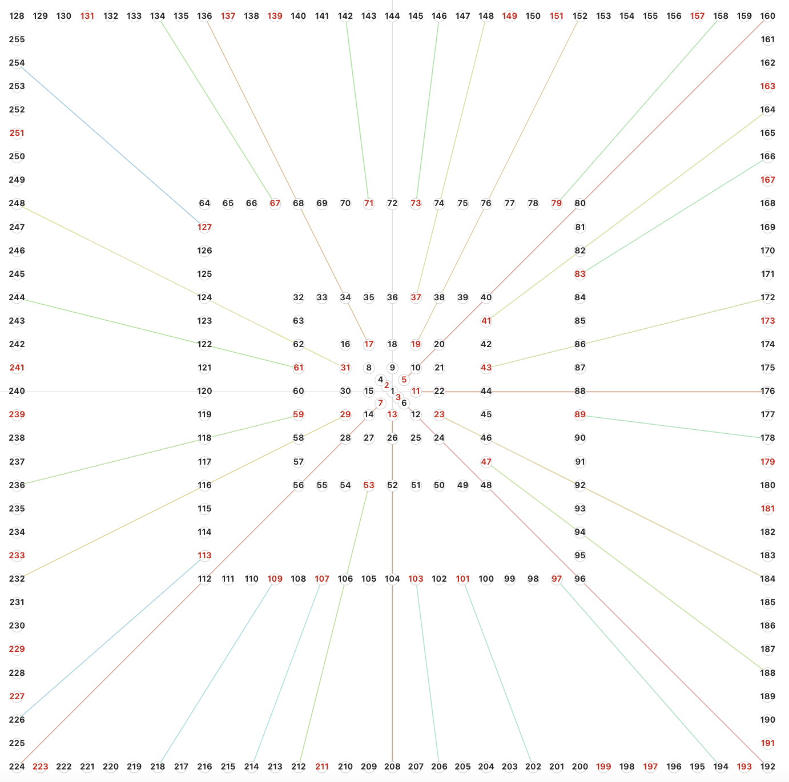
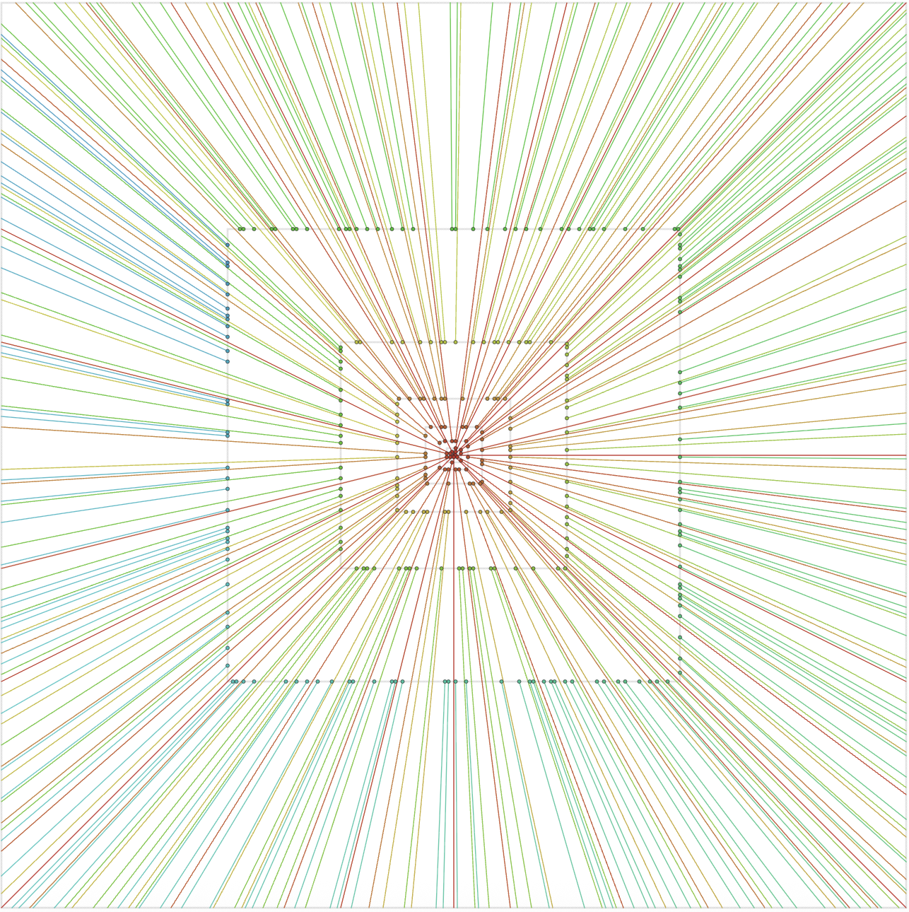
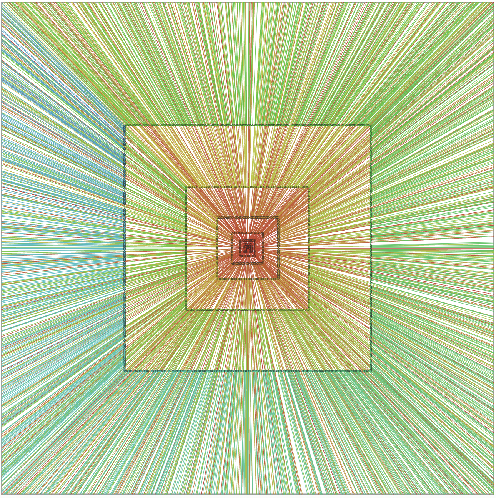
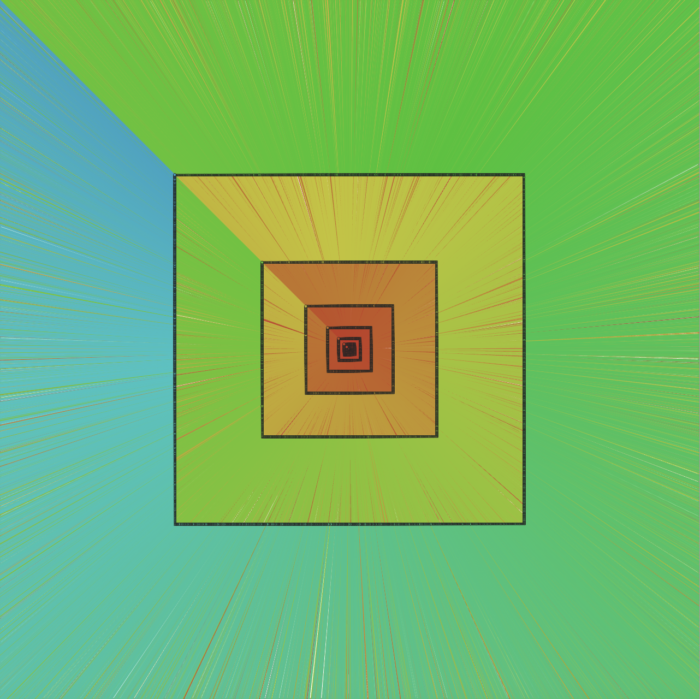
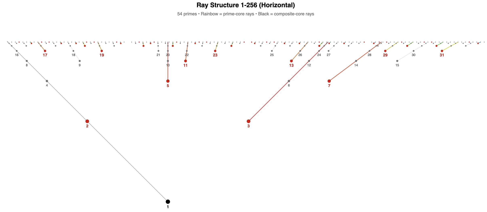

# Power-of-Two Square Rays

> **Disclaimer**  
>This is an AI-assisted exploratory visualization project.
>It is educational and experimental only—not peer-reviewed, not mathematical research, and not a new theorem.
>It does not serve as evidence for or against conjectures.
>This repository is math-art/visualization, not a research paper.
>Its purpose is educational exploration and aesthetic interest.
>Any visual patterns are artifacts of the construction.

---

## Overview

A geometric object constructed by mapping natural numbers to 2D coordinates
using the 2-adic decomposition. The construction uses only integer and bitwise
operations—no trigonometry in core logic.

Every positive integer has a unique decomposition:

```
n = 2^v2(n) × core(n)
```

Where:
- `v2(n)` = count of trailing zeros → determines the **shell**
- `core(n)` = odd part → determines the **ray**

The construction satisfies the scaling property: `C(2n) = 2 × C(n)`

---

## Two Equivalent Views

The same structure can be visualized from two angles:

| Square-Perimeter View | Ray-Structure View |
|-----------------------|--------------------|
| Shells = concentric squares | Shells = vertical lines |
| Rays radiate from center | Rays converge to point 1 |
| Angular position visible | Slope relationships visible |

Both preserve the bijection, scaling property, and all structural relationships.

### Square-Perimeter View

Integers 1–256 on concentric square shells with rays highlighted:



Odd-core rays at larger scales:







### Ray-Structure View

Same structure, different angle — shells as vertical lines, rays converging to point 1:



---

## Algorithm 1: Square Perimeter

For integer `n` in shell `k` (where `2^k ≤ n < 2^(k+1)`):

1. Square has radius `R = 2^k`
2. Perimeter parameter: `t = (n - 2^k) / 2^k`
3. Position clockwise on square perimeter from corner `(-R, R)`

**Theta-key** encodes angular position using bit-reversal (integer-only):

```
theta_key(a) = bit_reverse(a, k bits)
```

Top 2 bits determine edge: `00`=TOP, `01`=RIGHT, `10`=BOTTOM, `11`=LEFT

---

## Algorithm 2: Ray Structure

Let `X` = base unit, `Y` = vertical center.

**Step 1:** Place 1 at `(0, Y)`

**Step 2 (Shell 1):**
- Midpoint `M₁ = (X, Y)`
- Place 2 at `(X, Y - X)` — down from midpoint
- Place 3 at `(X, Y + X)` — up from midpoint

**Step 3 (Shell k ≥ 2):**
- Midpoint `M_k = (X × (2 - 2^(1-k)), Y)`
- Distance from previous midpoint: `X / 2^(k-1)`
- All midpoints lie on horizontal line `y = Y`

**Step 4 (Placing Numbers):**
Each odd core `c` defines a ray with slope `m_c`:

| Core | Slope | Property |
|------|-------|----------|
| 1 | -1 | Descending |
| 3 | +1 | Ascending |
| 5 | 0 | Horizontal |
| 7 | +4/3 | Steeper |

For integer `n` with `core(n) = c` in shell `k`:
```
x(n) = X × (2 - 2^(1-k))
y(n) = Y + m_c × x(n)
```

---

## Key Properties

- **Bijection:** `odd_core ↔ theta_key ↔ ray` (one-to-one)
- **Scaling:** `C(2n) = 2 × C(n)`
- **Shell spacing:** `Δx = X / 2^(k-1)` (halves each shell)
- **All coordinates rational** (no irrationals in construction)
- **Nested structure:** Shell k+1 inherits from shell k

---

## Python Tools

Main script: `demo.py`

```bash
# Square-perimeter visualization
python3 demo.py small-map --exp 8
python3 demo.py small-map --exp 8 --with-rays

# Odd-core rays
python3 demo.py odd-core-rays --exp 12

# Ray-structure visualization (horizontal or vertical)
python3 demo.py ray-structure --exp 9
python3 demo.py ray-structure --exp 9 --orientation vertical

# Coordinate analysis
python3 demo.py coord-analysis --exp 16
python3 demo.py coord-analysis --exp 16 --csv output.csv
python3 demo.py coord-analysis --exp 16 --ray 7
```

Shell analysis: `shell_walker.py`

```bash
python3 shell_walker.py --poly          # Coordinate patterns
python3 shell_walker.py --walk 6        # Walk through shell
python3 shell_walker.py --svg 6-9       # Slice visualization
```

---

## CUDA

Experimental CUDA code is in the `cuda/` directory.

---

## Integer-Native Computation

All core operations use only integers and bitwise ops:

| Operation | Implementation |
|-----------|----------------|
| `shell(n)` | `bit_length(n) - 1` |
| `core(n)` | `n >> ctz(n)` |
| `v2(n)` | `ctz(n)` |
| `theta_key(a)` | `bit_reverse(a)` |

Floating-point appears only in SVG pixel rendering.

---

## Outputs

- SVG visualizations (square-perimeter and ray-structure views)
- CSV coordinate exports
- Shell slice analysis

---

## License

MIT License

## Author

Nenad Micic (nenad@micic.be)  
Brussels, Belgium — 2025
